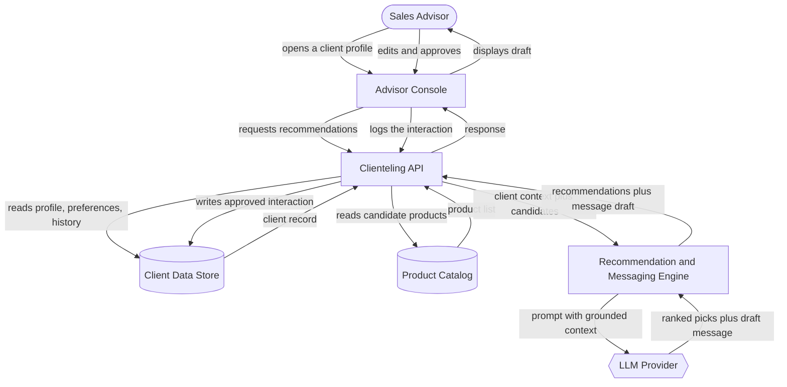

# Architecture: AI-Powered Clienteling Assistant

## The Idea

> I want to build an AI-powered clienteling assistant for luxury retail advisors. It helps sales associates manage client profiles, understand preferences, recommend relevant products, and create personalized outreach messages. On day one, it must do one thing extremely well: generate personalized client recommendations and elegant follow-up messages based on client history and preferences.

## Components

| Component | What it does for this project | Words that required it |
|---|---|---|
| Advisor Console (frontend) | The screen a sales associate opens to look at a client, see suggested products, and read a drafted message before sending it. | "sales associates," "manage client profiles" — a human uses this system, so it needs a screen |
| Clienteling API (backend) | The traffic cop that takes a request from the console, pulls the right data from storage, hands it to the AI layer, and sends the result back. | Implied — the console can't talk to the database or the AI layer directly without something coordinating the request |
| Client Data Store (database) | Holds each client's profile, stated and observed preferences, and purchase/interaction history — the record an advisor is managing and the context the AI reasons over. | "manage client profiles," "understand preferences," "client history" — this data must outlive a single visit to the console |
| Product Catalog (database) | Holds the products an advisor could recommend, so "relevant" has something to be relevant *to*. | "recommend relevant products" |
| Recommendation & Messaging Engine (AI layer) | Reads a client's profile, preferences, and history alongside the product catalog, ranks the products most likely to land, and drafts a follow-up message in the advisor's voice. This is the component that exists specifically to guarantee the day-one promise. | "understand preferences," "recommend relevant products," "create personalized outreach messages," and directly, the day-one sentence |
| LLM Provider (third party) | The language model the Recommendation & Messaging Engine calls to do the actual ranking-by-meaning and writing. | "generate," "personalized," "elegant follow-up messages" — this requires reasoning over meaning, not a lookup table |

No queue: nothing in the idea is described as slow or bursty. No auth/multi-tenant layer: the paragraph describes one advisor's workflow, not account management. No message-delivery service (email/SMS/WhatsApp): the paragraph says *create* outreach messages, not *send* them — see "What This Design Does Not Cover."

## How It Fits Together

## Data Flow

1. The advisor opens a client's profile in the Advisor Console.
2. The Console asks the Clienteling API for recommendations and a draft message for that client.
3. The API reads the client's profile, preferences, and history from the Client Data Store.
4. The API reads candidate products from the Product Catalog.
5. The API hands both — client context and candidate products — to the Recommendation & Messaging Engine.
6. The Engine builds a prompt grounded in that context and sends it to the LLM Provider.
7. The LLM returns a ranked set of product picks and a drafted follow-up message.
8. The Engine passes the recommendations and draft back through the API to the Console.
9. The Console shows the advisor the recommendations and the draft message.
10. The advisor edits and approves the message; the Console logs that approved interaction back through the API into the Client Data Store, so the next recommendation has one more data point of real history.

## Build Order

| Phase | Builds | What it proves |
|---|---|---|
| 1 — Data foundation | Client Data Store schema, Product Catalog schema, a bare-bones Advisor Console that can display one client record | The data model actually holds what an advisor needs to see |
| 2 — The day-one promise | Recommendation & Messaging Engine wired to the LLM Provider for a single hard-coded test client | Recommendations and a message draft can be generated end-to-end — this is the one thing that must work well before anything else matters |
| 3 — Real grounding | Product Catalog wired into the Engine's ranking, multiple real clients | Recommendations are grounded in actual inventory, not a placeholder list |
| 4 — Advisor workflow | Console UI for reviewing, editing, and approving a draft; approved interactions written back to the Client Data Store | An advisor can use this in a real workday, and every use makes the next recommendation better |
| 5 — Deferred | Authentication, multi-advisor/multi-store support, message delivery integrations, analytics | Explicitly out of scope for day one — see below |

## Assumptions

| Assumption | Impact if wrong |
|---|---|
| Product catalog data already exists in some exportable form (a PIM, an inventory system, even a spreadsheet) | If no such source exists, the Product Catalog has to be built and populated from scratch before Phase 3 can start, pushing back grounded recommendations |
| Messages are drafted for the advisor to send themselves, not auto-sent by the system | If auto-send is actually required, a message-delivery integration (email/SMS/WhatsApp) becomes a day-one component, not a deferred one |
| This is single-advisor / single-store scope for day one | If multiple advisors or stores need to share or partition client data immediately, an auth and permissions layer moves from Phase 5 into Phase 1 |
| The AI layer is a general-purpose LLM API, not a custom-trained recommendation model | If off-the-shelf ranking quality isn't good enough, a dedicated recommendation model becomes its own component and its own build phase |

**The one question that would most change this design:** *Does the assistant need to send the message itself, or only draft it for the advisor to send?* If it must send, a message-delivery service becomes a day-one component and the Clienteling API needs delivery-status tracking; if draft-only, the current design holds as-is.

## What This Design Does Not Cover

- Authentication or access control for advisors
- Sending messages (email, SMS, WhatsApp delivery)
- Multi-store or multi-brand support
- Analytics or reporting on outreach effectiveness
- Real-time inventory sync with the Product Catalog
